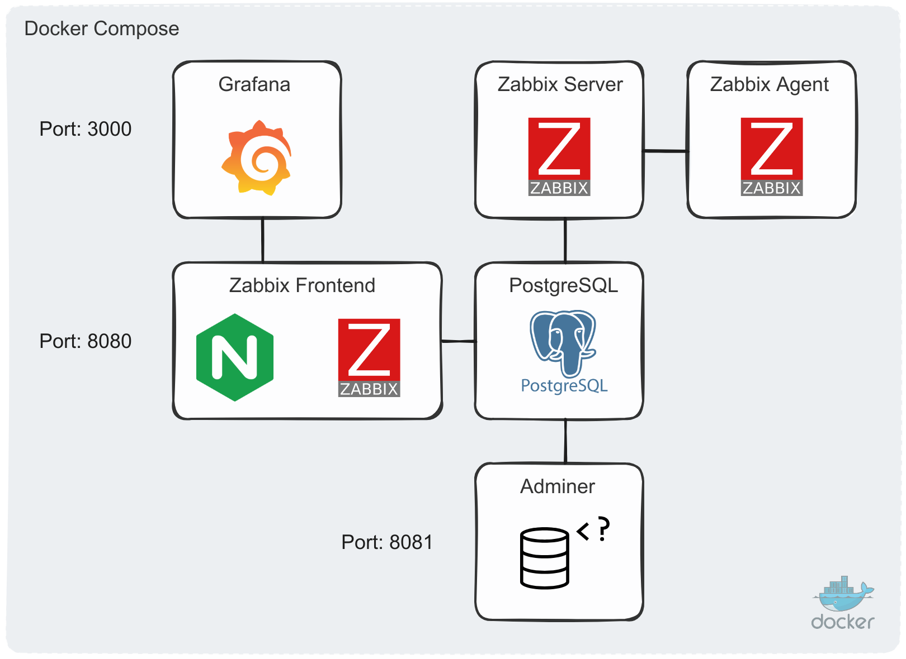

# Docker Compose: Zabbix + NGINX + PostgreSQL + Grafana + Adminer

Este proyecto proporciona una configuración de Docker Compose para desplegar un stack completo de monitoreo y visualización.

## Componentes

- Zabbix (Server, Frontend con NGINX, Agent)
- PostgreSQL
- Grafana
- Adminer



## Versiones de los servicios

| Servicio               | Versión        |
|------------------------|-----------------|
| PostgreSQL             | 16.2            |
| Zabbix Server          | 7.2 / 6.4       |
| Zabbix Frontend (NGINX)| 7.2 / 6.4       |
| Zabbix Agent           | 7.2 / 6.4       |
| Grafana                | 10.3.5          |
| Adminer                | 4.8.1           |

## Guía de instalación

1. Clonar el repositorio:
   ```bash
   git clone https://github.com/akmalovaa/zabbix-docker.git
   cd zabbix-docker
   ```

2. Configurar el entorno:
   - Revise y modifique el archivo `.env` según sus necesidades.

3. Lanzar los servicios:
   ```bash
   docker-compose up -d
   ```
   Nota: El primer lanzamiento puede tardar hasta 2 minutos.

## Acceso a los servicios

### Zabbix
- URL: http://localhost:8080
- Usuario: Admin
- Contraseña: zabbix

### Grafana
- URL: http://localhost:3000
- Usuario: admin
- Contraseña: 12345

Nota: Para cambiar la configuración de autenticación anónima, modifique `grafana/grafana.ini` (auth.anonymous).

### Adminer
- URL: http://localhost:8081

## Configuración adicional

### Zabbix Agent
Configure el host de Zabbix Server utilizando el nombre DNS para zabbix-agent:


### Fuente de datos en Grafana
1. Vaya a `Grafana -> Connections -> Data sources -> Zabbix`
2. Haga clic en "Test" para verificar la conexión:


## Depuración

Para ver los logs de los contenedores en tiempo real:
```bash
docker-compose logs --tail=1 -f
```

## Enlaces útiles

- [Dockerfiles oficiales de Zabbix](https://github.com/zabbix/zabbix-docker)
- [Plugin de Zabbix para Grafana](https://github.com/grafana/grafana-zabbix)
